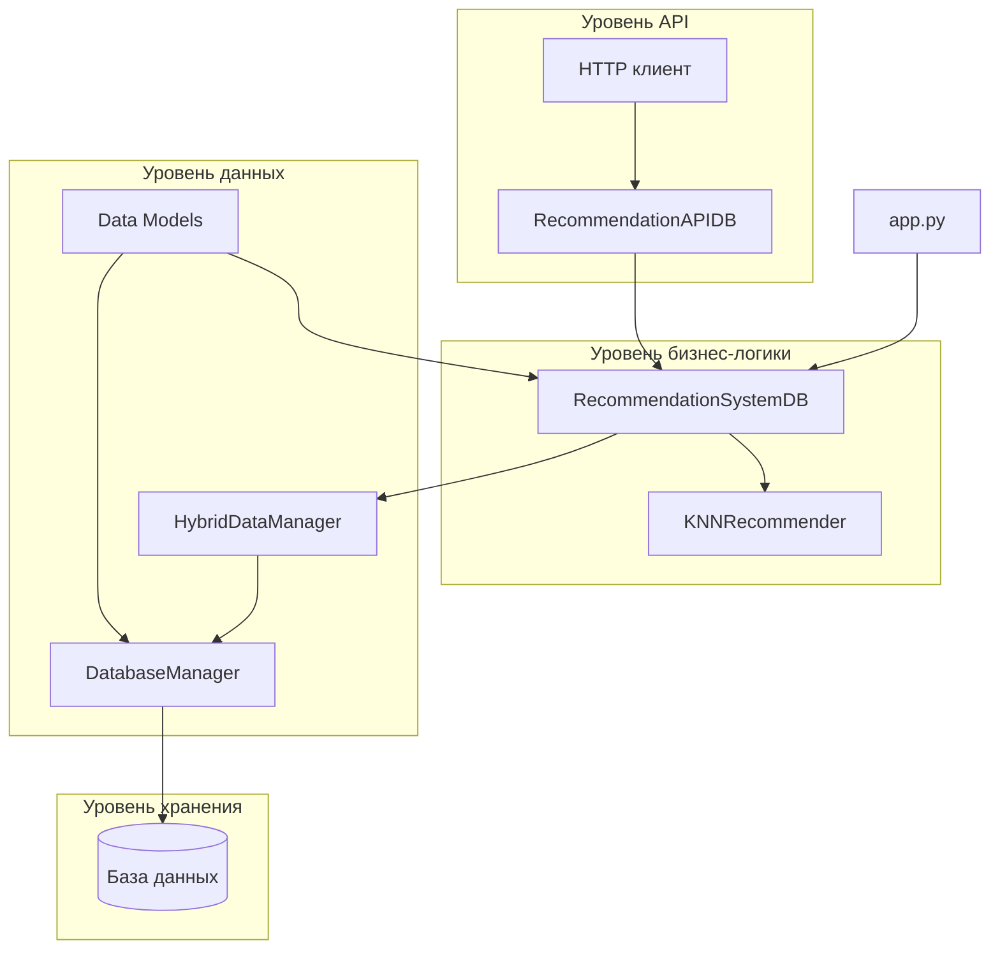
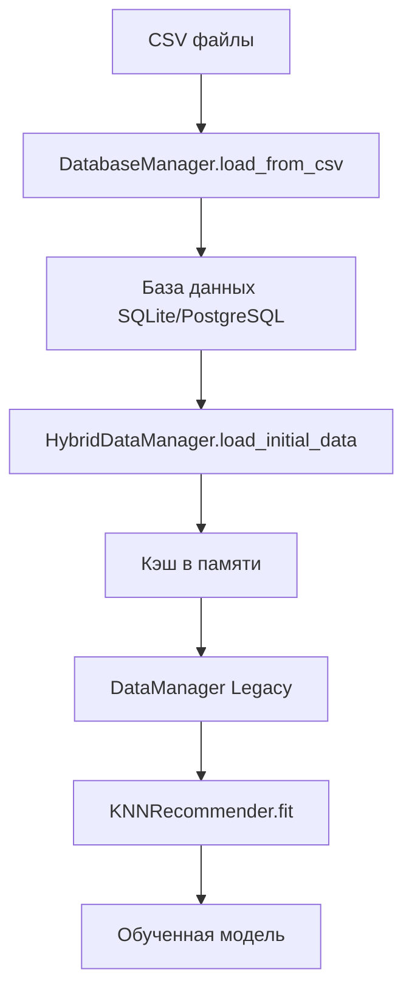
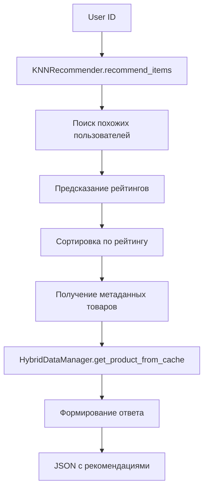
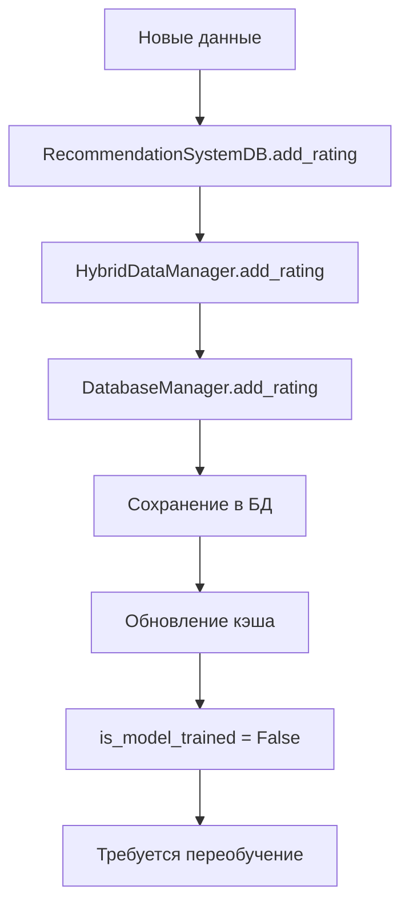

# 🏗️ Архитектура рекомендательной системы

## 📋 Содержание

- [Обзор архитектуры](#обзор-архитектуры)
- [Компоненты системы](#компоненты-системы)
- [Взаимодействие модулей](#взаимодействие-модулей)
- [Потоки данных](#потоки-данных)
- [Схемы базы данных](#схемы-базы-данных)
- [API архитектура](#api-архитектура)
- [Кэширование](#кэширование)
- [Масштабируемость](#масштабируемость)

## 🎯 Обзор архитектуры

Система построена по принципу **модульной архитектуры** с четким разделением ответственности между компонентами. Основные принципы:

- **Разделение ответственности** - каждый модуль решает конкретную задачу
- **Слабая связанность** - модули взаимодействуют через четко определенные интерфейсы
- **Высокая связность** - внутри модуля компоненты тесно связаны
- **Расширяемость** - легко добавлять новые алгоритмы и источники данных
- **Производительность** - кэширование и оптимизированные запросы к БД

## 🔧 Компоненты системы

### 1. RecommendationSystemDB
**Основной класс системы** - координирует работу всех компонентов.

```python
class RecommendationSystemDB:
    def __init__(self, database_url, approach, n_neighbors, auto_load=True):
        self.data_manager = HybridDataManager(database_url)
        self.recommender = KNNRecommender(...)
        if auto_load:
            self.load_data_from_db()
            self.train_model()
```

**Ответственности:**
- Инициализация и координация компонентов
- Загрузка данных из БД
- Обучение модели рекомендаций
- Предоставление API для получения рекомендаций
- Управление жизненным циклом системы

### 2. HybridDataManager
**Менеджер данных** - абстракция над базой данных с кэшированием.

```python
class HybridDataManager:
    def __init__(self, database_url):
        self.db_manager = DatabaseManager(database_url)
        self._cache = {}
    
    def load_initial_data(self):
        # Загрузка из БД с кэшированием
        pass
```

**Ответственности:**
- Загрузка данных из БД
- Кэширование в памяти для быстрого доступа
- Обновление кэша при изменении данных
- Предоставление единого интерфейса для доступа к данным

### 3. DatabaseManager
**Менеджер базы данных** - работа с БД через SQLAlchemy ORM.

```python
class DatabaseManager:
    def __init__(self, database_url):
        self.engine = create_engine(database_url)
        self.Session = sessionmaker(bind=self.engine)
    
    def create_tables(self):
        # Создание таблиц
        pass
```

**Ответственности:**
- Создание и управление схемой БД
- CRUD операции с данными
- Загрузка данных из CSV файлов
- Управление соединениями с БД

### 4. KNNRecommender
**Алгоритм рекомендаций** - реализация k-NN алгоритма.

```python
class KNNRecommender:
    def __init__(self, n_neighbors, metric, approach):
        self.n_neighbors = n_neighbors
        self.metric = metric
        self.approach = approach
    
    def fit(self, ratings_df):
        # Обучение модели
        pass
```

**Ответственности:**
- Реализация k-NN алгоритма
- Обучение модели на данных рейтингов
- Предсказание рейтингов
- Поиск похожих пользователей/товаров
- Генерация рекомендаций

### 5. RecommendationAPIDB
**RESTful API** - веб-интерфейс для системы.

```python
class RecommendationAPIDB:
    def __init__(self, recommendation_system):
        self.rec_system = recommendation_system
        self.app = Flask(__name__)
        self._register_routes()
```

**Ответственности:**
- Предоставление RESTful API
- Валидация входных данных
- Обработка HTTP запросов
- Сериализация ответов в JSON
- Обработка ошибок

### 6. Data Models
**Модели данных** - структуры для представления сущностей.

```python
class User:
    def __init__(self, user_id, name, email, age, gender):
        self.user_id = user_id
        self.name = name
        self.email = email
        self.age = age
        self.gender = gender

class Product:
    def __init__(self, product_id, name, category, price, brand):
        self.product_id = product_id
        self.name = name
        self.category = category
        self.price = price
        self.brand = brand

class Rating:
    def __init__(self, user_id, product_id, rating, timestamp, review):
        self.user_id = user_id
        self.product_id = product_id
        self.rating = rating
        self.timestamp = timestamp
        self.review = review
```

## 🔄 Взаимодействие модулей

### Диаграмма взаимодействия



### Последовательность операций

#### 1. Инициализация системы
```
app.py → RecommendationSystemDB.__init__()
  ↓
RecommendationSystemDB → HybridDataManager.__init__()
  ↓
HybridDataManager → DatabaseManager.__init__()
  ↓
RecommendationSystemDB → KNNRecommender.__init__()
  ↓
RecommendationSystemDB.load_data_from_db()
  ↓
HybridDataManager.load_initial_data()
  ↓
DatabaseManager.load_all_data()
  ↓
RecommendationSystemDB.train_model()
  ↓
KNNRecommender.fit()
```

#### 2. Получение рекомендаций
```
HTTP Request → RecommendationAPIDB.get_user_recommendations()
  ↓
RecommendationSystemDB.get_recommendations()
  ↓
KNNRecommender.recommend_items()
  ↓
HybridDataManager.get_product_from_cache()
  ↓
JSON Response
```

#### 3. Добавление новых данных
```
HTTP Request → RecommendationAPIDB.add_rating()
  ↓
RecommendationSystemDB.add_rating()
  ↓
HybridDataManager.add_rating()
  ↓
DatabaseManager.add_rating()
  ↓
RecommendationSystemDB.is_model_trained = False
```

## 📊 Потоки данных

### 1. Загрузка данных при инициализации



### 2. Получение рекомендаций



### 3. Добавление новых данных



## 🗄️ Схемы базы данных

### Таблица Users
```sql
CREATE TABLE users (
    user_id INTEGER PRIMARY KEY,
    name VARCHAR(255) NOT NULL,
    email VARCHAR(255) UNIQUE NOT NULL,
    age INTEGER,
    gender VARCHAR(10),
    registration_date TIMESTAMP DEFAULT CURRENT_TIMESTAMP
);
```

### Таблица Products
```sql
CREATE TABLE products (
    product_id INTEGER PRIMARY KEY,
    name VARCHAR(255) NOT NULL,
    category VARCHAR(100) NOT NULL,
    price DECIMAL(10,2) NOT NULL,
    description TEXT,
    brand VARCHAR(100),
    in_stock BOOLEAN DEFAULT TRUE,
    created_at TIMESTAMP DEFAULT CURRENT_TIMESTAMP
);
```

### Таблица Ratings
```sql
CREATE TABLE ratings (
    rating_id INTEGER PRIMARY KEY AUTOINCREMENT,
    user_id INTEGER NOT NULL,
    product_id INTEGER NOT NULL,
    rating DECIMAL(2,1) NOT NULL CHECK (rating >= 1.0 AND rating <= 5.0),
    timestamp TIMESTAMP DEFAULT CURRENT_TIMESTAMP,
    review TEXT,
    FOREIGN KEY (user_id) REFERENCES users(user_id),
    FOREIGN KEY (product_id) REFERENCES products(product_id),
    UNIQUE(user_id, product_id)
);
```

### Индексы для производительности
```sql
CREATE INDEX idx_ratings_user_id ON ratings(user_id);
CREATE INDEX idx_ratings_product_id ON ratings(product_id);
CREATE INDEX idx_ratings_timestamp ON ratings(timestamp);
CREATE INDEX idx_users_email ON users(email);
CREATE INDEX idx_products_category ON products(category);
```

## 🌐 API архитектура

### RESTful дизайн

API следует принципам REST:
- **Ресурсы** - пользователи, товары, рейтинги
- **HTTP методы** - GET, POST, PUT, DELETE
- **Статус коды** - 200, 201, 400, 404, 500
- **JSON формат** - для всех запросов и ответов

### Структура ответов

#### Успешный ответ
```json
{
  "success": true,
  "data": { ... },
  "message": "Операция выполнена успешно"
}
```

#### Ответ с ошибкой
```json
{
  "success": false,
  "error": "Описание ошибки",
  "code": 400
}
```

### Валидация данных

```python
def validate_rating_data(data):
    required_fields = ['user_id', 'product_id', 'rating']
    for field in required_fields:
        if field not in data:
            raise ValueError(f"Обязательное поле отсутствует: {field}")
    
    if not isinstance(data['rating'], (int, float)) or data['rating'] < 1 or data['rating'] > 5:
        raise ValueError("Рейтинг должен быть числом от 1 до 5")
```

## 💾 Кэширование

### Стратегия кэширования

1. **Кэш в памяти** - для часто используемых данных
2. **Lazy loading** - загрузка по требованию
3. **Инвалидация кэша** - при изменении данных

### Реализация кэша

```python
class HybridDataManager:
    def __init__(self):
        self._users_cache = {}
        self._products_cache = {}
        self._ratings_cache = {}
        self._cache_timestamp = None
    
    def get_product_from_cache(self, product_id):
        if product_id in self._products_cache:
            return self._products_cache[product_id]
        
        # Загрузка из БД
        product = self.db_manager.get_product(product_id)
        self._products_cache[product_id] = product
        return product
    
    def refresh_cache(self):
        """Обновление кэша из БД"""
        self._users_cache.clear()
        self._products_cache.clear()
        self._ratings_cache.clear()
        self._cache_timestamp = datetime.now()
```

### Оптимизация запросов

```python
def get_user_ratings_batch(self, user_ids):
    """Получение рейтингов для нескольких пользователей одним запросом"""
    ratings = self.db_manager.get_ratings_for_users(user_ids)
    for rating in ratings:
        user_id = rating.user_id
        if user_id not in self._ratings_cache:
            self._ratings_cache[user_id] = []
        self._ratings_cache[user_id].append(rating)
```

## 📈 Масштабируемость

### Горизонтальное масштабирование

1. **Микросервисная архитектура**
   - Отдельный сервис для рекомендаций
   - Отдельный сервис для управления данными
   - API Gateway для маршрутизации

2. **Балансировка нагрузки**
   - Несколько экземпляров API
   - Распределение запросов между серверами

### Вертикальное масштабирование

1. **Оптимизация алгоритма**
   - Использование более эффективных структур данных
   - Параллельная обработка
   - Кэширование промежуточных результатов

2. **Оптимизация базы данных**
   - Индексы для быстрых запросов
   - Партиционирование таблиц
   - Репликация для чтения

### Производительность

#### Метрики производительности
- **Время ответа API** - < 100ms для простых запросов
- **Время обучения модели** - < 30 секунд для 1000 пользователей
- **Пропускная способность** - > 1000 запросов в секунду

#### Оптимизации
```python
# Использование numpy для векторных операций
def compute_similarity_matrix(ratings_matrix):
    return cosine_similarity(ratings_matrix)

# Кэширование вычислений
@lru_cache(maxsize=1000)
def get_user_similarity(user_id1, user_id2):
    return compute_user_similarity(user_id1, user_id2)

# Батчевая обработка
def process_recommendations_batch(user_ids, n_recommendations):
    recommendations = {}
    for user_id in user_ids:
        recommendations[user_id] = get_recommendations(user_id, n_recommendations)
    return recommendations
```

## 🔒 Безопасность

### Аутентификация и авторизация
- JWT токены для API
- Роли пользователей (admin, user)
- Валидация входных данных

### Защита данных
- Шифрование паролей
- SQL injection защита через ORM
- Валидация всех входных данных

## 📊 Мониторинг и логирование

### Метрики системы
- Количество активных пользователей
- Время ответа API
- Использование памяти и CPU
- Количество ошибок

### Логирование
```python
import logging

logger = logging.getLogger(__name__)

def get_recommendations(self, user_id, n_recommendations):
    logger.info(f"Получение рекомендаций для пользователя {user_id}")
    try:
        recommendations = self._get_recommendations(user_id, n_recommendations)
        logger.info(f"Найдено {len(recommendations)} рекомендаций")
        return recommendations
    except Exception as e:
        logger.error(f"Ошибка при получении рекомендаций: {e}")
        raise
```

## 🚀 Развертывание

### Docker контейнеризация
```dockerfile
FROM python:3.9-slim

WORKDIR /app
COPY requirements.txt .
RUN pip install -r requirements.txt

COPY . .
EXPOSE 3002

CMD ["python", "app.py"]
```

### Kubernetes развертывание
```yaml
apiVersion: apps/v1
kind: Deployment
metadata:
  name: recommendation-api
spec:
  replicas: 3
  selector:
    matchLabels:
      app: recommendation-api
  template:
    metadata:
      labels:
        app: recommendation-api
    spec:
      containers:
      - name: api
        image: recommendation-system:latest
        ports:
        - containerPort: 3002
        env:
        - name: DATABASE_URL
          value: "postgresql://user:pass@db:5432/recommendations"
```

---

Эта архитектура обеспечивает:
- **Модульность** - легко тестировать и расширять
- **Производительность** - кэширование и оптимизации
- **Масштабируемость** - готовность к росту нагрузки
- **Надежность** - обработка ошибок и мониторинг
- **Безопасность** - защита данных и API
